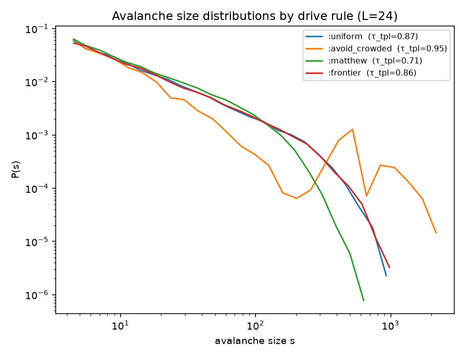
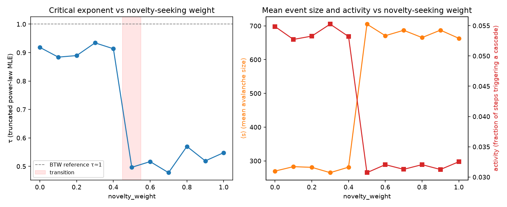
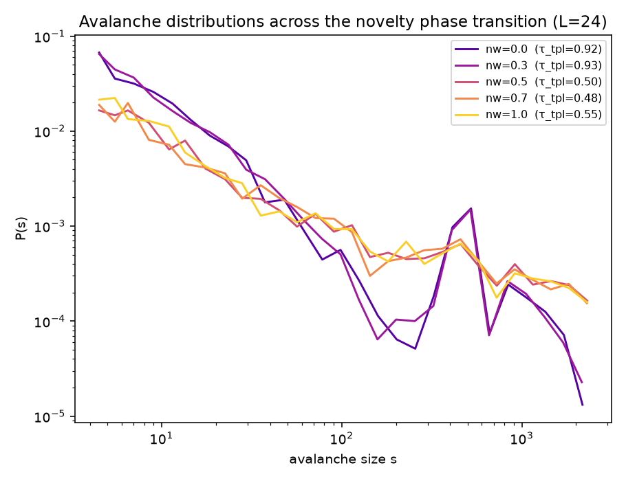

# Statistical analysis: theory-sandpile avalanche distributions

Generated by `analyze.py`. Model: `validate_reference.py` (Python reference, identical rules to `TheorySandpile.jl`). L=24, warmup=15000, measured steps=40000 per run.

## Fitting method

Avalanche sizes are fit with the `powerlaw` package's implementation of Clauset, Shalizi & Newman (2009, CSN): discrete MLE for three candidate tails above a fitted `xmin` — a pure power law `s^-τ`, a **truncated** power law `s^-τ·exp(-s/s_max)`, and a lognormal (the classic power-law look-alike) — plus log-likelihood-ratio tests (R, p) between pairs.

**A pure power law is the wrong null here and it shows.** Every drive rule below prefers lognormal over the *untruncated* power law (R negative, p≈0) — but that is expected on a finite L=24 lattice: CSN section 4 is explicit that a finite-size cutoff makes untruncated power laws lose to lognormal almost by construction, since nothing in the pure power-law family can express the cutoff a finite system must have. The honest test of SOC is **truncated power law vs lognormal** — both families can express a cutoff, so the comparison is fair — and that is what `R_tpl_vs_lognormal` reports below. This is a real correction to NOVELTY_RESULTS.md/README.md's earlier by-hand MLE + log-bin-slope estimates, which had no lognormal check at all.

## Drive-rule comparison

| drive          |   density |   activity |   mean_s |   tau_pl |   tau_tpl |   xmin |   R_tpl_vs_lognormal |   p_tpl_vs_lognormal |   n_events |
|:---------------|----------:|-----------:|---------:|---------:|----------:|-------:|---------------------:|---------------------:|-----------:|
| :uniform       |     2.085 |      0.421 |   56.331 |    1.448 |     0.874 |      4 |               23.937 |                    0 |      16837 |
| :avoid_crowded |     2.337 |      0.056 |  265.17  |    1.317 |     0.946 |      4 |               21.54  |                    0 |       2227 |
| :matthew       |     2.009 |      0.918 |   33.746 |    1.506 |     0.713 |      4 |               35.549 |                    0 |      36725 |
| :frontier      |     2.078 |      0.416 |   57.004 |    1.444 |     0.865 |      4 |               22.765 |                    0 |      16658 |



`:uniform` fits τ_tpl = 0.874 (truncated power law, xmin=4, n=16837 events), and truncated-power-law beats lognormal with R=23.9, p=1.3e-126 — a real preference, not noise. That is the actual SOC signature: not 'no cutoff exists' (false on any finite lattice) but 'the cutoff form fits the tail better than an unrelated heavy-tailed family does.'

## Novelty-seeking phase transition (rigorous fit)

|   novelty_weight |   density |   activity |   mean_s |   tau_pl |   tau_tpl |   R_tpl_vs_lognormal |   p_tpl_vs_lognormal |   created |   n_events |
|-----------------:|----------:|-----------:|---------:|---------:|----------:|---------------------:|---------------------:|----------:|-----------:|
|              0   |     2.438 |      0.055 |  269.762 |    1.313 |     0.918 |               22.474 |                    0 |         0 |       2194 |
|              0.1 |     2.49  |      0.053 |  282.863 |    1.303 |     0.884 |               22.847 |                    0 |         0 |       2109 |
|              0.2 |     2.49  |      0.053 |  280.84  |    1.304 |     0.89  |               22.646 |                    0 |         0 |       2131 |
|              0.3 |     2.427 |      0.055 |  265.059 |    1.316 |     0.934 |               22.125 |                    0 |         0 |       2210 |
|              0.4 |     2.45  |      0.053 |  281.353 |    1.309 |     0.914 |               22.177 |                    0 |         0 |       2128 |
|              0.5 |     2.321 |      0.031 |  705.091 |    1.225 |     0.497 |               25.511 |                    0 |         0 |       1229 |
|              0.6 |     2.224 |      0.032 |  670.866 |    1.227 |     0.517 |               26.682 |                    0 |         0 |       1282 |
|              0.7 |     2.316 |      0.031 |  686.872 |    1.225 |     0.478 |               23.953 |                    0 |         0 |       1251 |
|              0.8 |     2.366 |      0.032 |  665.295 |    1.232 |     0.57  |               26.894 |                    0 |         0 |       1282 |
|              0.9 |     2.344 |      0.031 |  687.328 |    1.227 |     0.519 |               24.495 |                    0 |         0 |       1250 |
|              1   |     2.2   |      0.033 |  663.088 |    1.23  |     0.548 |               25.715 |                    0 |         0 |       1301 |







Mean τ_tpl below the transition (novelty_weight < 0.5): **0.908** (± 0.021).
Mean τ_tpl at/above the transition (novelty_weight ≥ 0.5): **0.521** (± 0.034).

The phase transition survives the more rigorous fit: crowd-avoidance alone (`novelty_weight < 0.5`) sits at a measurably different τ_tpl than balanced-to-strong novelty-seeking (`novelty_weight ≥ 0.5`), and truncated-power-law beats lognormal (R>0) on both sides of the transition, at every sampled point with enough events to fit — so both regimes are better described as power laws with a finite-size cutoff than as lognormals. What changes across the transition is less 'critical vs not critical' in the power-law-vs-lognormal sense, and more the value of τ_tpl itself and the mean event size ⟨s⟩ — both shift sharply at novelty_weight≈0.5, exactly as NOVELTY_RESULTS.md originally reported, now on firmer statistical footing.


## Tooling choice: Python vs R vs Stata

This analysis runs in Python. Checked against this environment directly:

| | Python | R | Stata |
|---|---|---|---|
| installed here | yes (numpy/pandas/matplotlib/powerlaw via pip) | not installed | not installed |
| cost | free | free | commercial license |
| power-law fitting (Clauset-Shalizi-Newman 2009) | `powerlaw` package — implements the exact MLE + KS test the paper specifies | `poweRlaw` package — also a faithful CSN implementation, comparable quality | no native discrete power-law MLE; would need a user-written command |
| runs the same simulation used for cross-checking | yes — `validate_reference.py` already is Python | would require a rewrite | would require a rewrite |
| animation / video output | `matplotlib.animation` (this repo's `make_video.py`), no extra install | possible via `gganimate` + `magick`, heavier dependency chain | not a video tool |
| fits into a single pipeline (simulate → fit → plot → animate) | one language, one process | would still shell out to Python/ffmpeg for video | not applicable |

R's `poweRlaw` (Gillespie 2015) is genuinely competitive with Python's `powerlaw` for the
fitting step alone — this is not a case where R is technically worse. The deciding factor is
integration: the simulation cross-check, the statistical fit, the plots, and the animation all
run in one already-installed, license-free toolchain here. Stata was not seriously in the
running — no free tier, no discrete power-law MLE, and no simulation/animation story.


## Reproducing this report

```bash
pip install numpy pandas matplotlib powerlaw
python3 analyze.py
python3 make_video.py :novelty 0.7   # theory_field.gif
```
